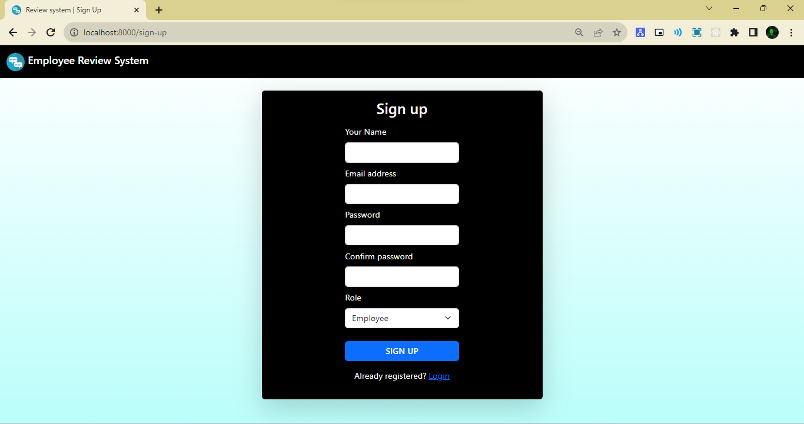
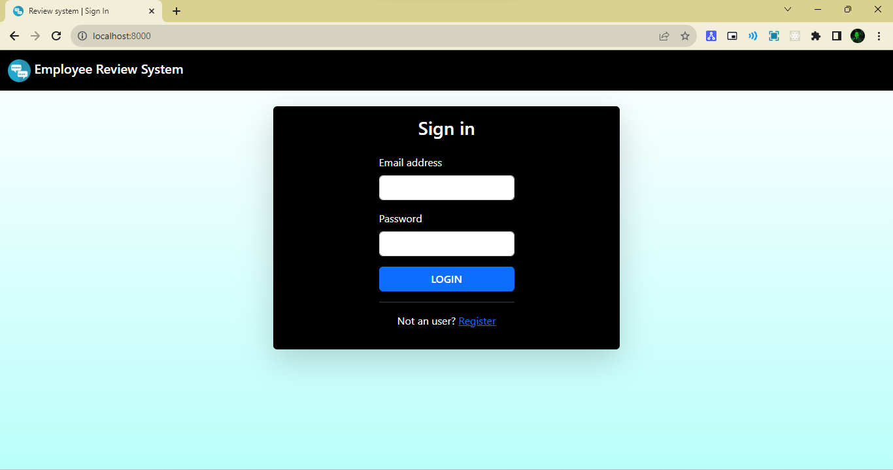
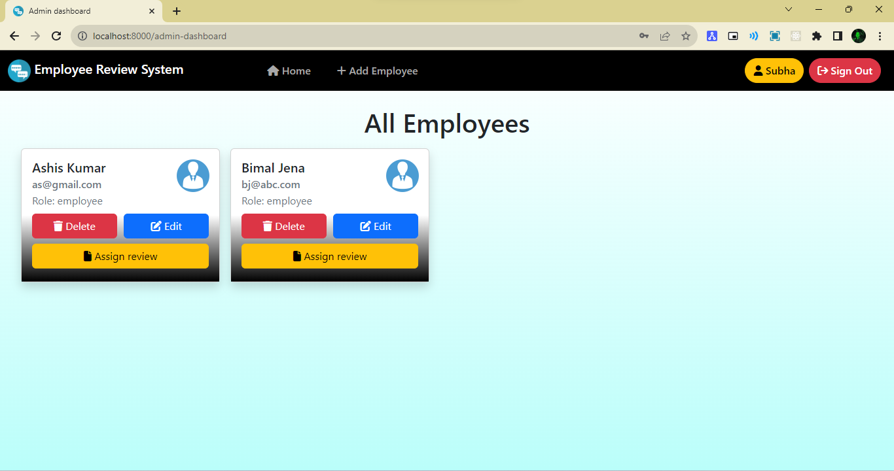
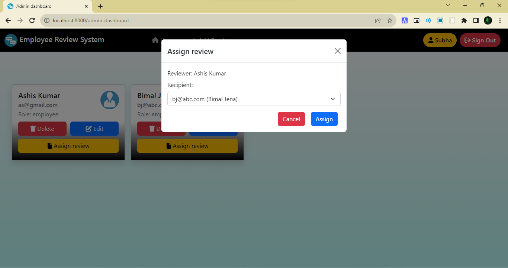
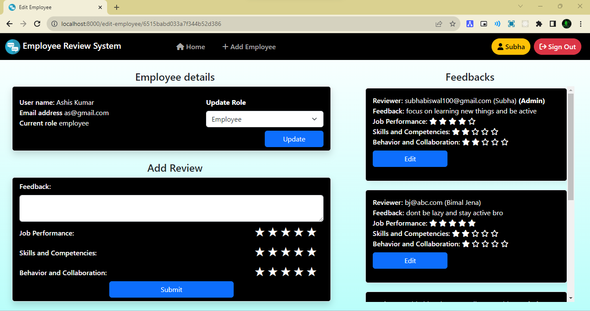
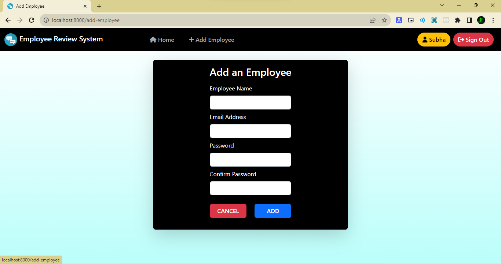
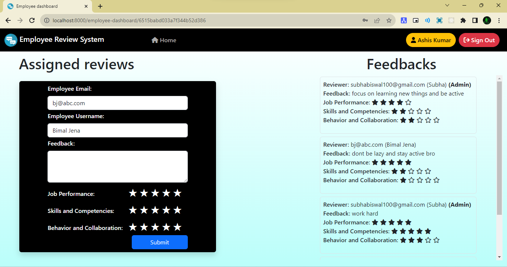

# NodeJS-Employee Review System

 <h1 align="center">Employee Review System  📝</h1> 

 🖊️ This is an application that allows employees to submit feedback toward each other’s performance  
     This App built using <a href="https://ejs.co/">EJS</a>, <a href="https://www.mongodb.com/">MongoDB</a>, <a href="https://expressjs.com/">ExpressJs</a>, <a href="https://nodejs.org/en/">NodeJs</a> and <a href="http://www.passportjs.org/">PassportJS</a>

## Table of contents

-   [Features](#Features)
-   [Folder Structure](#Folder-Structure)
-   [Page Screenshot](#Page-Screenshots)
-   [Built with](#built-with)
-   [Libraries](#Libraries)
-   [Author](#author)
-   [Setup](#Setup)
-   [Run](#Run)
-   [Deploy Link](#deployed-link)

## Features

-   <b>Admin's functions</b>

    -   Add employee
    -   Delete employee
    -   Update employee details
    -   Assign review to employee
    -   Update review of employee
    -   Give review to an employee

-   <b>Employee's functions</b>
    -   Submit reviews assigned to it
    -   View reviews given by others

## Folder Structure

-   Employee Review System
    -   assets
        -   css
            -   common.css
            -   star.css
        -   images
            -   logo.png
    -   config
        -   database.js
        -   middleware.js
        -   passport-local-startegy.js
    -   controller
        -   dashboard_controller.js
        -   review_controller.js
        -   users_controller.js
    -   models
        -   review.js
        -   user.js
    -   routes
        -   index.js
        -   review.js
        -   users.js
    -   views
        -   _header.ejs
        -   add_employee.ejs
        -   admin_dashboard.ejs
        -   edit_employee.ejs
        -   employee_dashboard.ejs
        -   layout.ejs
        -   user_dign_in.ejs
        -   user-sign-up.ejs
    -   .env
    -   index.js
    -   package-lock.json
    -   package.json

## page Screenshots

-   Sign Up
      

-   Sign In
      

-   Admin Home Page
      

-   Assign review
      

-   Edit Employee
      

-   Add Employee
      

-   Sign In
      

-   Employee Home Page
      

### Built with

-   NodeJS
-   MongoDB
-   ExpressJS
-   EJS
-   Bootstrap
-   CSS

### Libraries:

-   bcryptjs
-   connect-flash
-   connect-mongo
-   cookie-parser
-   dotenv
-   ejs
-   express
-   express-ejs-layout
-   express-session
-   mongoose
-   passport
-   passport-jwt
-   passport-local

## Author

-   Github - [Subha Biswal](https://github.com/20SB)

## Setup

Run `npm install` to install required dependencies

## Run

Run `npm start`, open localhost:8000 in browser to run the program

## Deployed Link

-[Placement Cell]()
